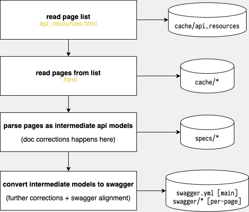

# GitLab API doc crawler
Crawl GitLab API doc for OpenAPI spec generation.  
GitLab doesn't provide official Swagger/OpenAPI nor official API client in any language neither.  

With 885 endpoint (not including pages with weird arrangement that I can't parse)
I can do it myself.

## Crawling/Generation process


## Run instruction
### Prerequisite 
- [Deno](https://deno.land/)

Recommend to also use VSCode and install official Deno extension for the best development experiences.  
Deno options and launch settings are preconfigured for VSCode.

Or run via command line
```shell
$ deno run --allow-all index.ts
```

Run tests
```shell
$ deno test
```

## Roadmap
- [x] Crawl pages and create intermediate models
- [x] Make corrections to page parsing up to 90%
- [x] Generate and freeze
  - [x] 14.10
  - [ ] 15.0-pre?
- [ ] Put specs to a separated repo and crowdsource hand corrections
- [ ] Generate GitLabKit REST API clients
  - [ ] .net
  - [ ] JavaScript/TypeScript
  - [ ] python
  - [ ] Go
  - [ ] Rust